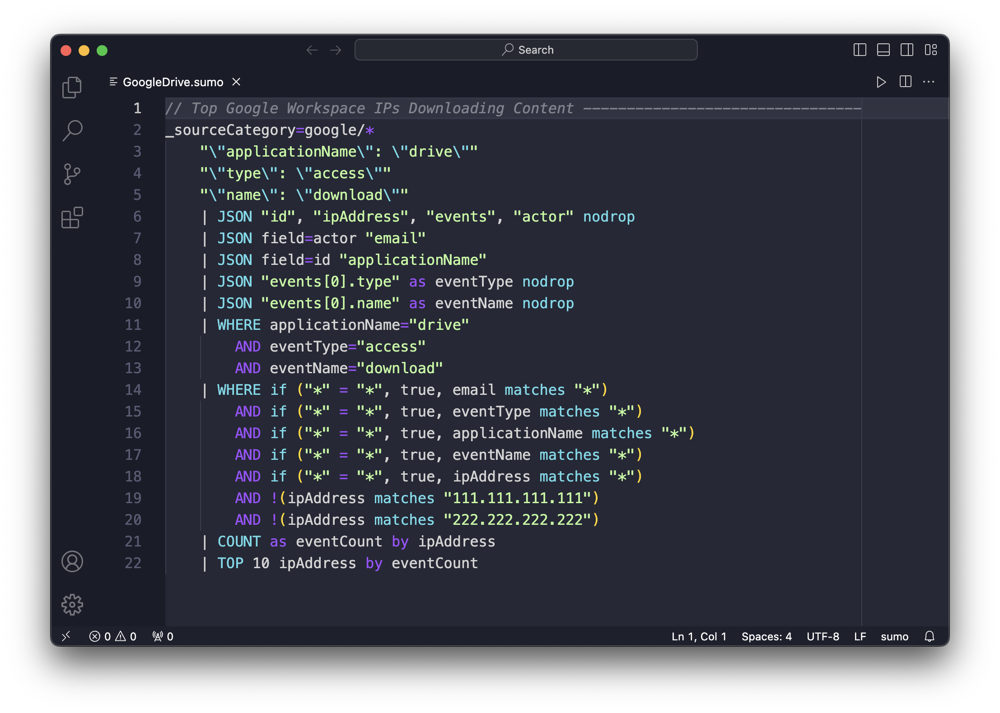

# Sumo Logic Queries

General collection of Sumo Logic Queries for IT and Security. In most case you need to update the `_sourceCategory={{log_source}}` line of each query to point to your source categories. 

For syntax highlighting you can install the [sumo-logic-highlight](https://marketplace.visualstudio.com/manage/publishers/nicscott/extensions/sumo-logic-highlight/hub?_a=acquisition)  Visual Studio Code Extension.
